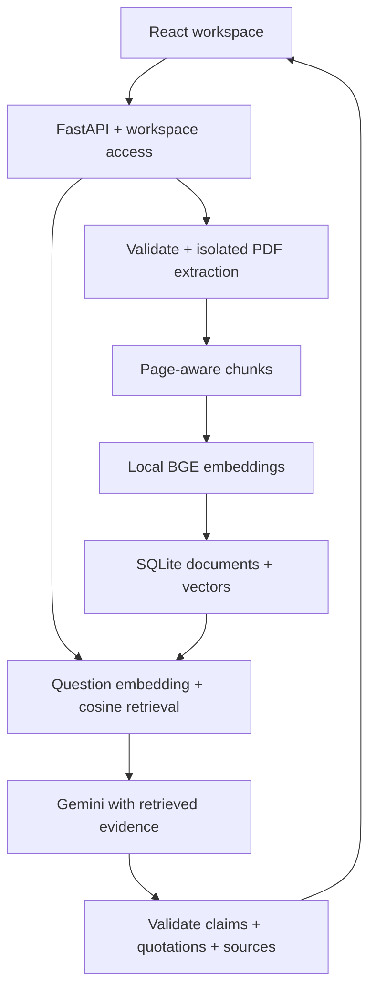

# ClarityOps AI

ClarityOps is a company knowledge assistant built on the recovered FastAPI + React
application. Upload a text-based PDF, ask a company question, and receive an answer
with document/page evidence. The original local demo remains available; an opt-in
member mode now isolates company workspaces and separates owners from employees.
This is a pilot foundation, not an approved hosted environment for confidential data.

## Current capabilities

- PDF validation, bounded extraction, physical page numbers, and useful processing errors.
- Local semantic embeddings and transactional SQLite storage of PDFs, chunks and vectors.
- Grounded Gemini answers with validated source IDs, verbatim evidence and numeric checks.
- Explicit insufficient-evidence responses; no generic Gemini chat fallback.
- React upload, document list, questions, answers, source quotations, PDF downloads and deletion.
- Revocable, expiring member access with owner/employee permissions and separate company databases.
- Bounded requests, per-workspace rate limits, redacted errors, and metadata-only management audit events.
- Automated API, semantic retrieval, provider-contract and browser tests.

**Verification boundary:** real local embeddings and ingestion are tested. Provider
contract/failure tests use SDK mocks and the real SDK with an offline HTTP transport.
The browser test server uses a separate test-only answer generator. Live Gemini tests require a key and explicit
opt-in. The owner reported seven successful live tests and Windows browser use after
commit `1c06282`; later provider failures were reported as quota exhaustion. This Work
run made no live Gemini calls. See [current results](docs/CONTINUATION_2026-09-20.md)
and the [original verification report](docs/VERIFICATION.md).

## Architecture



No vector database service is required. `BAAI/bge-small-en-v1.5` runs on the CPU
through FastEmbed/ONNX, using a pinned model revision and 384-dimensional vectors.
In member mode, the authenticated membership selects a separate SQLite database;
no client-supplied company ID selects storage or retrieval. Only the question and
up to five retrieved snippets are sent to Gemini. Original
PDFs and embeddings remain on the machine hosting the backend. No question or
answer history is persisted by ClarityOps.

See [architecture decisions](docs/ARCHITECTURE.md) and [security boundaries](docs/SECURITY.md).

## Prerequisites

- Python **3.12** (tested on Linux; Windows commands provided but not executed here).
- Node.js **22.12+** and npm. The existing Vite 8 application is retained.
- Internet for dependency installation, the one-time approximately 67 MB embedding
  model download, and Gemini requests. Document indexing works offline after setup.
- A Gemini API key for generated answers. Never put it in frontend variables or Git.

## Setup and run: Windows PowerShell

Run from the repository root. These commands use the virtual environment's Python
directly, so PowerShell script activation is unnecessary.

```powershell
cd backend
py -3.12 -m venv .venv
.\.venv\Scripts\python.exe -m pip install -r requirements.txt
.\.venv\Scripts\python.exe scripts\init_env.py
notepad .env
```

In `backend/.env`, set `GEMINI_API_KEY` locally. `init_env.py` generates
`CLARITYOPS_ACCESS_TOKEN` without printing it. Copy that workspace token from the
file into the app's unlock form; do not paste the Gemini key into the app. Existing
`.env` files are never overwritten; add missing variables manually if one exists.

```powershell
.\.venv\Scripts\python.exe scripts\prepare_embeddings.py
.\.venv\Scripts\python.exe -m uvicorn app.main:app --host 127.0.0.1 --port 8000 --no-access-log
```

In a second terminal, from the repository root:

```powershell
cd frontend
npm.cmd ci
npm.cmd run dev
```

Open **http://127.0.0.1:5173** and unlock the workspace. The Vite development proxy
forwards `/api` to the loopback backend at port 8000. `GET http://127.0.0.1:8000/health`
returns `{"status":"ok"}` without a Gemini key. Upload and extraction also work
without a Gemini key; asking a supported question returns a controlled 503 until
answer generation is configured. An unsupported question can abstain without a key.

## Setup and run: macOS / Linux

```sh
cd backend
python3.12 -m venv .venv
.venv/bin/python -m pip install -r requirements.txt
.venv/bin/python scripts/init_env.py
# Edit backend/.env locally: set GEMINI_API_KEY and keep the generated access token.
.venv/bin/python scripts/prepare_embeddings.py
.venv/bin/python -m uvicorn app.main:app --host 127.0.0.1 --port 8000 --no-access-log
```

In another terminal:

```sh
cd frontend
npm ci
npm run dev
```

To build the frontend: `npm run build`. `npm run preview` is a local build preview,
not a production deployment. To use it on port 4173, explicitly include
`http://127.0.0.1:4173` in `CLARITYOPS_CORS_ORIGINS` and restart the backend.

## Configuration

| Variable | Purpose |
| --- | --- |
| `GEMINI_API_KEY` | Backend-only provider secret; blank permits startup and ingestion. |
| `GEMINI_MODEL` | Defaults to the existing `gemini-2.5-flash`; other models need validation. |
| `CLARITYOPS_AUTH_MODE` | `demo` (default, existing shared collection) or `members` (isolated companies). |
| `CLARITYOPS_DEPLOYMENT` | `local` (default) or `private`; private requires member mode and HTTPS CORS origins. This does not create TLS or deploy anything. |
| `CLARITYOPS_ACCESS_TOKEN` | At least 32 random characters for demo mode; ignored in member mode. |
| `CLARITYOPS_DATA_DIR` | Defaults to `backend/data`; relative values resolve against backend, not shell cwd. |
| `CLARITYOPS_CORS_ORIGINS` | Comma-separated exact frontend origins; wildcard is rejected. |

`.env` loading does not override existing environment variables. Restart the backend
after changes. Browser tokens stay in memory and are cleared on reload/lock.
Demo-token holders have equal permissions. Member tokens identify one person/role in
one company, expire within 30 days and can be revoked by an owner. They are access
credentials, not password-based accounts or SSO sessions.

## Isolated company workspaces and member access

After the ordinary setup above, from `backend` on Windows:

```powershell
.\.venv\Scripts\python.exe scripts\pilot_admin.py create-workspace --name "Synthetic Company" --owner "Owner" --credential-file .\data\owner-access.json
notepad .env
notepad .\data\owner-access.json
```

Set `CLARITYOPS_AUTH_MODE=members` in `.env` and restart the backend. Use the new
owner token from the private JSON file to unlock. The helper never prints tokens and
refuses to overwrite a credential file. If you changed `CLARITYOPS_DATA_DIR`, choose
a credential-file path inside that directory instead. Treat the file as a secret.

Owners upload/remove PDFs and use **Manage member access** to create or revoke
employee/owner tokens. Employees can list documents, ask questions and download
sources; write operations are denied by the server before body parsing. Tokens are
shown once and stored as hashes. Company creation/recovery requires a local operator;
there is no public registration endpoint.

This mode starts with empty isolated collections. Existing demo documents stay in
their original database; they are never assigned to a company automatically. Re-upload
only deliberately approved PDFs. Full [pilot setup, roles, recovery, backup and
hosting runbook](docs/PILOT.md).

## Usage and demo

1. Unlock the workspace and upload `samples/Meridian_Works_Handbook.pdf`.
2. Wait for "ready for questions".
3. Ask "How many casual leave days do employees receive per calendar year?"
4. With a working Gemini key, expect 12 days, with the synthetic handbook's page 1
   and an exact supporting quote. Treat this as a demo expectation until live tests pass.
5. Ask "What is our parental leave allowance?" Expect insufficient evidence.
6. Download a cited PDF, retry the same upload (deduplicated), then remove the document.

Full [demo script](docs/DEMO.md). The fixture has five fictional policies and no
real customer data. Regenerate it with `python scripts/make_sample_pdf.py` after
installing development requirements.

## API

All routes except `/` and `/health` require `X-ClarityOps-Token`. Preflights for
allowed origins are supported. API documentation routes are disabled in this MVP.

| Route | Behavior |
| --- | --- |
| `GET /health` | Liveness only; does not claim provider readiness. |
| `GET /status` | Authenticated configuration/file-presence indicators, not live provider validation. |
| `POST /upload` | Multipart `file`; extracts/indexes atomically; 201 new, 200 duplicate. |
| `POST /read-pdf` | Multipart `file`; returns page-aware text without storing or indexing. |
| `GET /documents` | Indexed document metadata and warnings. |
| `GET /documents/{id}/file` | Authenticated attachment download. |
| `DELETE /documents/{id}` | Atomically removes the PDF and its chunks/vectors; 204 success. |
| `POST /ask` | JSON `{"prompt":"your question"}`; answer, status and structured sources. |
| `GET /members`, `POST /members` | Member-mode owners list or issue scoped access. Creation returns a token once. |
| `DELETE /members/{id}` | Member-mode owner revokes another member; cannot revoke self. |
| `GET /audit` | Owner-only latest 100 document/membership management events. No question text or document content. |

`/ask` retains `response` as an alias of `answer` for the recovered frontend contract.
A source includes `document_id`, `document`, `page`, `chunk_id`, normalized character
offsets and exact `quotes`. Page means the PDF's one-based physical page, not printed
page numbering. Retrieval similarity is not presented as answer confidence.

Errors are `{"error":{"code":"...","message":"...","request_id":"..."}}`.
Validation/type errors use 400/415/422, size errors 413, access errors 401/403,
conflicts 409, local limits 429, missing model/key or provider quota 503, and other
provider failures 502. `provider_rate_limited` does not mean a schema regression;
stop repeated calls and check provider quota before retrying later.

## Tests

From `backend`, using the Python executable in `.venv`:

```sh
python -m pip install -r requirements-dev.txt
python -m pytest -q
python -m ruff check app scripts tests
```

Use `.venv/bin/python` on macOS/Linux or `.\.venv\Scripts\python.exe` on Windows
instead of bare `python` if the environment is not activated.

Real semantic tests require prepared embeddings:

```powershell
$env:RUN_SEMANTIC_TESTS="1"
.\.venv\Scripts\python.exe -m pytest -q
Remove-Item Env:RUN_SEMANTIC_TESTS
```

POSIX equivalent: `RUN_SEMANTIC_TESTS=1 .venv/bin/python -m pytest -q`.

Live Gemini tests send only synthetic policies and questions, and may incur provider
usage charges. Configure your key, then explicitly opt in:

```powershell
$env:RUN_LIVE_GEMINI="1"
.\.venv\Scripts\python.exe -m pytest -m live -q -x
Remove-Item Env:RUN_LIVE_GEMINI
```

POSIX equivalent: `RUN_LIVE_GEMINI=1 .venv/bin/python -m pytest -m live -q -x`.
Live tests fail if opted in without a key; they are skipped by default. `-x` stops at
the first failure. If quota is exhausted, stop and wait; do not repeatedly rerun them.

From `frontend`:

```sh
npm ci
npm run lint
npm run build
npx playwright install chromium
npm run test:e2e
```

Browser tests start isolated servers on ports 18000/15173 (demo) and 18001/15174
(members), with disposable workspaces, real extraction/retrieval, and a **test-only answer generator**. The
production app never selects this generator. Prepare embeddings and install backend
dev requirements first. `PLAYWRIGHT_CHROMIUM_EXECUTABLE` may specify an existing
compatible Chromium executable if the standard browser download is unavailable.

Dependency checks: `python -m pip_audit -r requirements.txt` in backend, `npm audit`
in frontend. Backend `.in` files declare direct dependencies; `.txt` files pin the
full resolution, including platform markers. Maintainers regenerate with
`uv pip compile requirements.in -o requirements.txt --universal --no-emit-index-url`
and the equivalent development command.

## Limits and pilot readiness

- English, text-based PDFs only; no OCR, DOCX or connectors. Complex layouts/tables
  and image-only pages may lose meaning. Blank pages produce visible warnings.
- 10 MiB/file, 100 pages, 500,000 extracted characters; 50 documents and 5,000 chunks
  per workspace. Limits are explicit in `app/config.py`.
- One server process; up to 20 member-mode companies, 100 member records/company
  (including revoked records), and the document/chunk limits above per company.
  Company databases are separate; model files and server/provider capacity are shared.
- Member tokens provide owner/employee authorization, not password accounts, MFA,
  SSO or per-document ACLs. Demo mode still uses a shared token and must stay local.
  Before a real pilot: private TLS deployment, encrypted storage/backups, provider
  data terms/retention review, operational monitoring and broader evaluations.
- Prompts and citation checks reduce fabrication; they do **not** prove semantic
  entailment or resistance to every prompt injection. Live answer quality is a gate.
- SQLite stores original PDFs and derived text unencrypted. OS encryption and
  restrictive hosting permissions are required for private data.
- Deletion removes local active data, not downloaded copies, backups, prior browser
  answers or snippets already sent to Gemini. No backup automation is included.
- Previous `backend/uploads` files are neither imported nor deleted automatically.
  Re-upload intentionally through the new pipeline; handle legacy copies separately.
- Do not expose Vite or Uvicorn development servers publicly. Nothing is deployed by
  this repository change.

For the baseline, implementation details and next work, see
[baseline audit](docs/BASELINE_AUDIT.md), [verification](docs/VERIFICATION.md), and
[cycle handoff](docs/HANDOFF.md).
